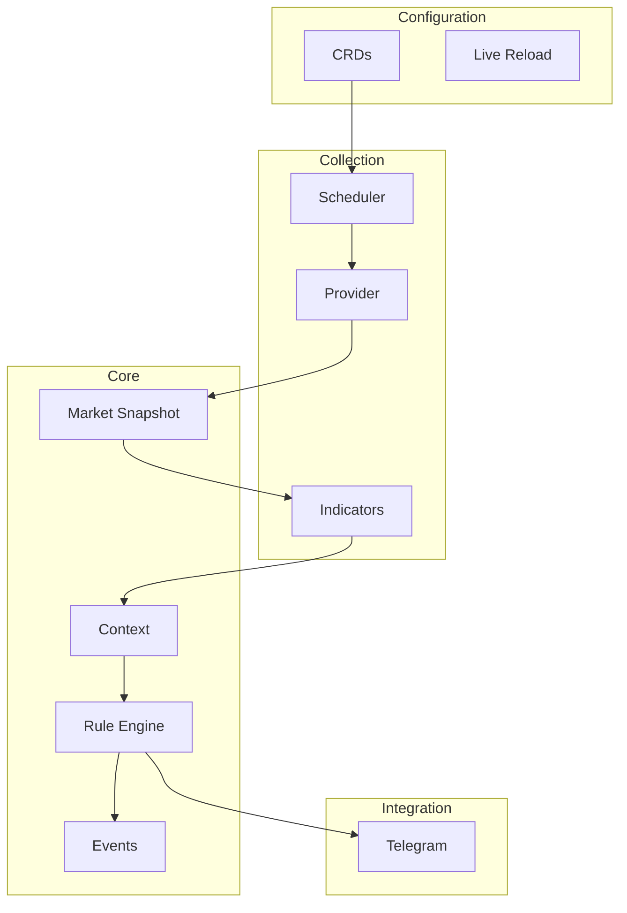
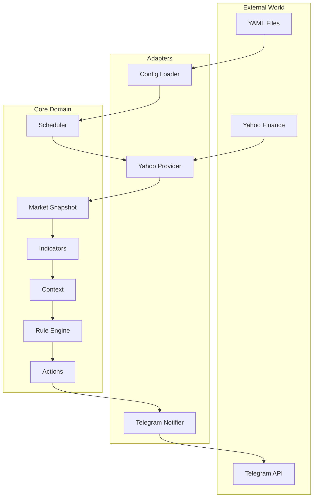
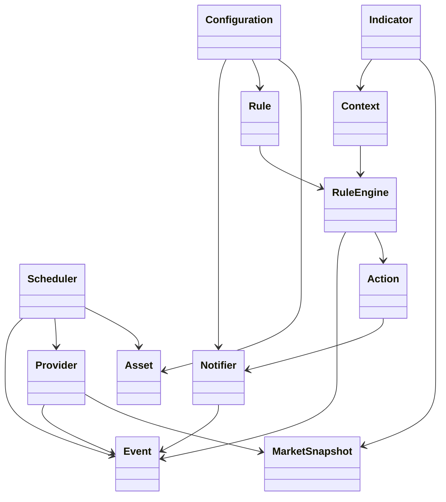
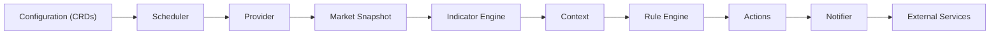

# RFC-0000 — Domain Model

**Status:** Draft
**Author:** carvalhosauro
**Version:** 1.0

---

# 1. Introduction

This document defines the domain model for **Vigil**.

Its goal is to establish a ubiquitous language for the project, ensuring that all components share the same concepts and responsibilities.

This document does not specify implementation details. Its focus is to describe the main domain concepts and how they relate to one another.

---

# 2. What is Vigil

Vigil is a declarative daemon for monitoring financial assets.

Its responsibility is to turn market data into actionable events through user-configured rules.

The logical application flow is:

```text
Configuration
        │
        ▼
Assets
        │
        ▼
Scheduler
        │
        ▼
Provider
        │
        ▼
Market Snapshot
        │
        ▼
Indicators
        │
        ▼
Context
        │
        ▼
Rule Engine
        │
        ▼
Actions
        │
        ▼
Notifiers
```

Each component has well-defined responsibilities and must remain decoupled from the others.

---

# 3. Architecture Overview

## 3.1 Component Layers



## 3.2 External Integration



---

# 4. Architectural Principles

Vigil follows these architectural principles:

- Configuration as Code
- Declarative architecture
- Decoupled components
- Separation between data acquisition and business rules
- Extensibility through contracts (Behaviours)
- High fault tolerance using OTP
- Live reload without a full application restart

---

# 5. Domain Model

## 5.1 Relationships



## 5.2 Configuration

Represents all declarative resources in the system.

Examples:

- Asset
- Rule
- Notification
- Defaults

Configuration is the single source of truth.

## 5.3 Asset

Represents a financial asset monitored by the system.

Examples:

- PETR4
- VALE3
- ITUB4

Responsibilities:

- identify the asset
- define which Provider to use
- define the update interval

An Asset has no rules and no business logic.

## 5.4 Scheduler

Responsible for determining when an Asset should be updated.

Each Asset has its own schedule.

The Scheduler never fetches data directly.

Its only responsibility is to start a collection cycle.

## 5.5 Provider

Responsible for fetching market data.

Future examples:

- Yahoo Finance
- Alpha Vantage
- Polygon
- Finnhub

All Providers must produce exactly the same output format.

## 5.6 Market Snapshot

Represents a set of raw data obtained from a Provider.

Example fields:

- price
- open
- high
- low
- close
- volume
- timestamp

A Market Snapshot represents only information coming from the market.

No additional calculations should exist in this object.

## 5.7 Indicator

An Indicator transforms a Market Snapshot into new information.

Examples:

- SMA
- EMA
- VWAP
- RSI
- ATR

Indicators never send notifications.

Indicators never query Providers.

They only compute new values.

## 5.8 Context

Represents the complete state of an Asset at a given point in time.

It is composed of:

- Market Snapshot
- indicators
- derived metrics
- state information

All Rule Engine evaluation occurs exclusively against a Context.

The Context is immutable during an evaluation cycle.

## 5.9 Rule

A Rule represents a logical condition.

It describes when a given action should be executed.

A Rule never queries Providers.

A Rule never performs calculations.

It only evaluates a Context.

## 5.10 Rule Engine

Responsible for evaluating all Rules.

Receives:

- Context

Produces:

- zero or more Actions

The Rule Engine must be completely independent of the Provider in use.

## 5.11 Action

An Action represents something that should happen when a Rule is satisfied.

Examples:

- send a message
- execute a webhook
- record an event

Actions represent intentions.

They do not know implementation details.

## 5.12 Notifier

A Notifier is responsible for executing an Action.

Future examples:

- Telegram
- Discord
- Slack
- Email
- Webhook

Only Telegram is supported in V1.

## 5.13 Event

Represents an occurrence produced during processing.

Examples:

- RuleTriggered
- NotificationSent
- ProviderUnavailable
- ReloadCompleted

Events are used for observability and auditing.

## 5.14 Runtime

Responsible for executing the monitoring cycle (RFC-0015).

It receives the Scheduler's trigger, calls the Provider, builds the Context, runs the Rule Engine, dispatches Actions, and advances State.

It owns retry and cycle-level failure handling.

The Runtime orchestrates; it never implements domain logic.

---

# 6. Processing Flow

Each monitoring cycle follows exactly the same flow:

1. The Scheduler starts a cycle for an Asset.
2. The Provider fetches market data.
3. A Market Snapshot is produced.
4. Indicators enrich the data.
5. A Context is built.
6. The Rule Engine evaluates all applicable Rules.
7. Satisfied Rules produce Actions.
8. Notifiers execute the Actions.
9. Events are recorded for observability.



Each step has a single responsibility and must not assume the responsibilities of others.

The cycle is orchestrated by the Runtime (RFC-0015): components never invoke one another directly.

---

# 7. Responsibilities and Dependencies

## 7.1 Component Responsibilities

| Component       | Responsibility                          |
| --------------- | --------------------------------------- |
| Asset           | Represent a monitored asset               |
| Scheduler       | Define when to monitor                    |
| Runtime         | Orchestrate the monitoring cycle (RFC-0015) |
| Provider        | Fetch market data                         |
| Market Snapshot | Represent raw data                        |
| Indicator       | Produce derived metrics                   |
| Context         | Consolidate the asset's current state     |
| Rule            | Express business conditions               |
| Rule Engine     | Evaluate rules                            |
| Action          | Represent an execution intent             |
| Notifier        | Execute an external action                |
| Configuration   | Declare resources                         |
| Event           | Record system occurrences                 |

## 7.2 Allowed Dependencies

Dependencies between components must strictly follow this flow:

```text
Configuration
        │
        ▼
Scheduler
        │
        ▼
Provider
        │
        ▼
Market Snapshot
        │
        ▼
Indicators
        │
        ▼
Context
        │
        ▼
Rule Engine
        │
        ▼
Actions
        │
        ▼
Notifier
```

Reverse dependencies are not allowed.

This flow describes the direction of data; at run time the Runtime (RFC-0015) mediates each step, so components never call one another directly.

For example:

- The Rule Engine does not query Providers.
- Indicators do not send notifications.
- Providers do not know about Rules.
- The Scheduler does not know about Telegram.

This separation reduces coupling and makes testing, maintenance, and system evolution easier.

---

# 8. Extensibility

Vigil is designed to evolve by adding new components without modifying the application core.

Future extension examples:

- new Providers
- new Indicators
- new Notifiers
- new Rule types
- new Action types

Every extension must respect the contracts defined in the specific RFCs.

---

# 9. Out of Scope

This RFC does not define:

- CRD format
- Rule Language syntax
- Provider contracts
- Scheduler
- persistence
- CLI
- observability
- error handling

These topics are specified in their own RFCs.

---

# 10. Glossary

| Term            | Definition                                                     |
| --------------- | -------------------------------------------------------------- |
| Asset           | Financial asset being monitored                                |
| Provider        | Market data source                                             |
| Market Snapshot | Raw data obtained from the market                              |
| Indicator       | Derived calculation over market data                           |
| Context         | Consolidated state of an asset                                 |
| Rule            | Logical condition evaluated against a Context                  |
| Rule Engine     | Engine responsible for evaluating Rules                        |
| Action          | Intent produced by a Rule                                        |
| Notifier        | Component that executes an Action                              |
| Event           | Record of a system occurrence                                  |
| Configuration   | Declarative resources that define application behavior         |
