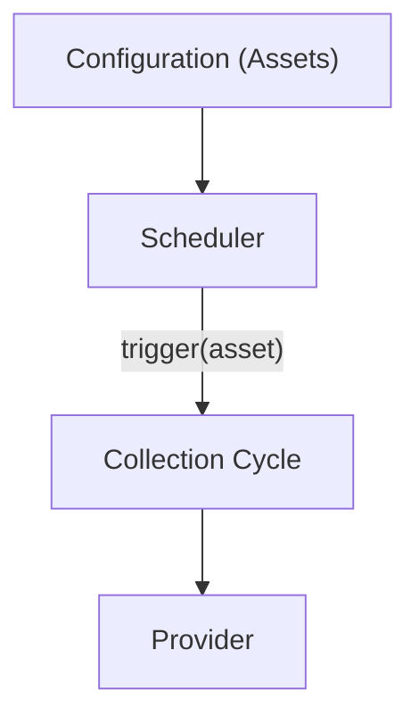
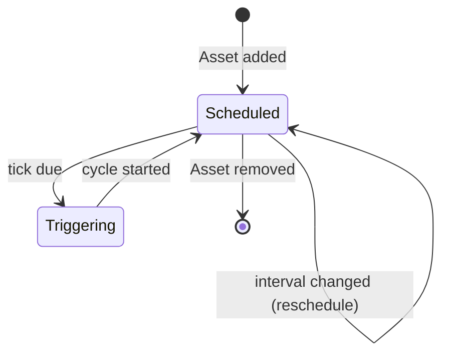

# RFC-0005 — Scheduler

**Status:** Draft
**Author:** carvalhosauro
**Version:** 1.0

---

# 1. Purpose

This RFC defines the **Scheduler**, the component responsible for deciding **when** an Asset should be collected.

The Scheduler controls the temporal rhythm of the system.

It never fetches data and never knows about Providers, Rules, or Notifiers.

Its only responsibility is to start a collection cycle at the right moment.

---

# 2. Motivation

Each Asset is monitored at its own cadence.

Some Assets require updates every few seconds, others every minute.

Centralizing timing logic in a single component:

* isolates time-related concerns;
* keeps the Provider stateless;
* allows per-Asset cadence;
* makes the system deterministic and testable.

The rest of the system must remain unaware of how timing is implemented.

---

# 3. Philosophy

The Scheduler must be:

* Independent of the Provider
* Independent of the Rule Engine
* Independent of Notifiers
* Per-Asset
* Fault-isolated
* Reconcilable at runtime

The Scheduler decides timing.

It does not decide behavior.

---

# 4. Responsibilities

The Scheduler must:

* maintain one independent schedule per Asset;
* trigger a collection cycle when an Asset is due;
* respect each Asset's configured interval;
* apply the global `Defaults` interval when none is set;
* stop scheduling for removed Assets;
* start scheduling for new Assets.

The Scheduler must never:

* fetch market data;
* parse responses;
* evaluate Rules;
* send notifications;
* persist market data.

---

# 5. Data Flow



The Scheduler emits a *cycle trigger* and stops there.

The Runtime wires the trigger to the Provider (RFC-0015).

---

# 6. Scheduling Model

Each Asset has an **independent schedule**.

```text
Asset: petr4   interval: 30s  ──► cycle every 30s
Asset: vale3   interval: 1m   ──► cycle every 60s
Asset: itub4   interval: 15s  ──► cycle every 15s
```

Schedules are isolated.

A failure or delay in one Asset's cycle must never affect another.

---

# 7. Triggering a Cycle

Conceptually, the Scheduler produces:

```text
trigger(asset)
```

This signal carries only the Asset identity.

It carries no market data.

The Runtime is responsible for invoking the correct Provider in response (RFC-0015 §6).

---

# 8. Intervals and Defaults

The effective interval for an Asset is resolved as:

1. the `interval` declared in the Asset (RFC-0003);
2. otherwise, the `polling.interval` from `Defaults`;
3. otherwise, a system-defined fallback.

```text
Asset.interval > Defaults.interval > System default
```

Intervals are expressed using the `duration` type (`15s`, `30s`, `1m`).

---

# 9. Market Hours

The Scheduler may be aware of market sessions.

When an Asset's market is closed:

* cycles may be suspended;
* cadence may be reduced.

V1 keeps this simple: scheduling continues regardless of market hours, and `market_open` is exposed in the Context (RFC-0002) for Rules to inspect.

Session-aware scheduling is a future extension.

---

# 10. Jitter and Drift

To avoid synchronized bursts when many Assets share the same interval, the Scheduler may apply small jitter.

Scheduling must also avoid **drift**: the interval is measured from the intended tick, not from the end of the previous cycle.

A slow cycle must not permanently delay subsequent cycles.

---

# 11. Concurrency

Cycles for different Assets run concurrently.

The Scheduler must:

* never block one Asset on another;
* tolerate a slow or failing collection cycle;
* keep each Asset's timing isolated.

Per-Asset isolation follows OTP supervision principles, where each schedule is an independent, supervised unit.

---

# 12. Failure Handling

If a collection cycle fails, the Scheduler still honors the next tick.

The Scheduler never retries the Provider itself.

Retry and backoff policies belong to the Runtime: categories in RFC-0013, concrete policy in RFC-0015 §10.

The Scheduler only guarantees that ticks keep happening.

A tick that fires while the previous cycle is still running is skipped, never queued (RFC-0015 §9).

---

# 13. Reconciliation

The Scheduler is reconciled when configuration changes (RFC-0006).

A single Asset's schedule follows this lifecycle:



| Change            | Scheduler action          |
| ----------------- | ------------------------- |
| Asset added       | start a new schedule      |
| Asset removed     | stop the schedule         |
| interval changed  | reschedule with new value |
| Asset unchanged   | no action                 |

Reconciliation must never restart unaffected schedules.

---

# 14. Observability

Every tick emits Events (RFC-0009).

Minimum events:

* scheduler.cycle.started
* scheduler.cycle.skipped
* scheduler.cycle.triggered

These events feed Observability (RFC-0011) and never alter scheduling behavior.

---

# 15. Extensibility

Future scheduling strategies must not change the trigger contract:

* market-session-aware scheduling;
* cron-style expressions;
* dynamic cadence based on volatility;
* alignment to wall-clock boundaries.

Each strategy only changes *when* a trigger fires, never *what* it carries.

---

# 16. Out of Scope

This RFC does not define:

* how data is fetched (RFC-0004);
* how Rules are evaluated (RFC-0001);
* retry and backoff (RFC-0013);
* configuration format (RFC-0003);
* live reload mechanics (RFC-0006).

---

# 17. Decisions

## DEC-001

The Scheduler never fetches data.

## DEC-002

Each Asset has an independent schedule.

## DEC-003

A trigger carries only the Asset identity.

## DEC-004

The effective interval is resolved Asset > Defaults > system fallback.

## DEC-005

A failing or slow cycle must never delay other Assets.

## DEC-006

Retry and backoff belong to the Runtime, not the Scheduler.

## DEC-007

The Scheduler is reconciled on configuration changes and never restarts unaffected schedules.
