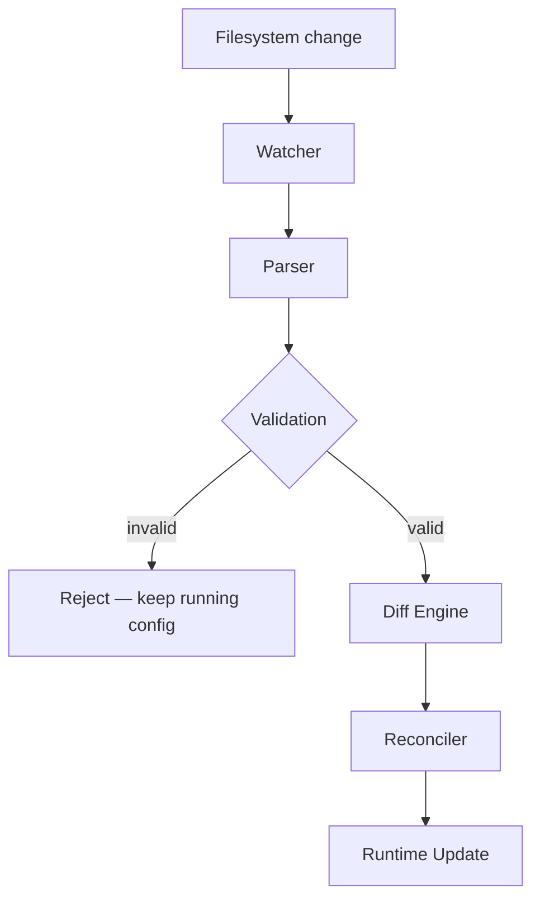
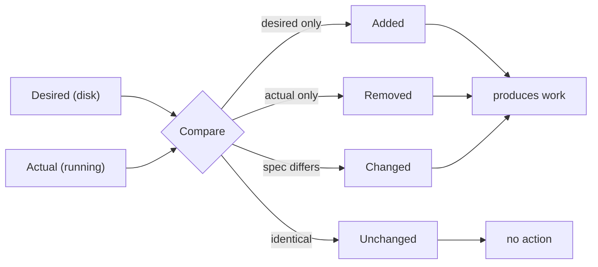

# RFC-0006 — Config Reload

**Status:** Draft
**Author:** carvalhosauro
**Version:** 1.0

---

# 1. Purpose

This RFC defines **Live Reload**: how Vigil applies configuration changes without a full restart.

The configuration resources are defined in RFC-0003.

This document specifies how changes to those resources are detected, validated, diffed, and applied to the running system.

---

# 2. Motivation

Vigil is a long-running daemon.

Restarting it to apply a configuration change would:

* interrupt active monitoring;
* lose runtime state;
* create downtime windows.

Live Reload lets the operator change Assets, Rules, and Notifiers while the daemon keeps running.

---

# 3. Philosophy

Reload must be:

* Declarative
* Atomic
* Safe
* Non-disruptive
* Reversible on failure

The system reconciles its running state toward the declared desired state, the same model used by Kubernetes controllers.

A reload never partially applies a broken configuration.

---

# 4. Desired State Model

The configuration directory is the single source of truth.

```text
Desired State  =  the resources on disk
Actual State   =  what the daemon is currently running
Reload         =  reconcile Actual toward Desired
```

The reconciler computes the difference and applies only what changed.

---

# 5. Reload Flow



This expands the flow sketched in RFC-0003 §10.

The validation branch is the atomicity guarantee of §9: a broken configuration never reaches the Reconciler.

---

# 6. Watching

The configuration directory is watched continuously.

A change is any create, modify, rename, or delete of a resource file.

To avoid reacting to partial writes, changes are **debounced**: a short quiet period must pass before a reload is attempted.

---

# 7. Parsing

All resource files are parsed into in-memory resources.

A parse covers the **entire** desired state, not a single file.

This ensures cross-resource references are resolved against the complete picture.

---

# 8. Validation

The parsed desired state is fully validated before anything is applied.

Validation includes everything from RFC-0003 §9:

* schema and types;
* required fields;
* missing references;
* invalid values;
* duplicate names within a Kind.

If validation fails, the reload is rejected as a whole.

---

# 9. Atomicity

Reload is **all-or-nothing**.

```text
valid    ──► apply the full diff
invalid  ──► reject, keep current configuration
```

The running configuration is only ever replaced by another fully valid configuration.

A broken file on disk never degrades the running system.

---

# 10. Diff Engine

The Diff Engine compares desired and actual state per resource and classifies each as:



| Result    | Meaning                          |
| --------- | -------------------------------- |
| added     | exists in desired, not in actual |
| removed   | exists in actual, not in desired |
| changed   | exists in both, spec differs     |
| unchanged | identical                        |

Only `added`, `removed`, and `changed` produce work.

---

# 11. Applying Changes

Each affected component reconciles itself based on the diff:

| Resource | added            | changed              | removed          |
| -------- | ---------------- | -------------------- | ---------------- |
| Asset    | start schedule   | reschedule           | stop schedule    |
| Rule     | register rule    | replace rule         | unregister rule  |
| Notifier | register target  | update target        | remove target    |
| Defaults | recompute        | recompute            | recompute        |

Unchanged resources are never touched.

Scheduler reconciliation follows RFC-0005 §13.

---

# 12. Runtime State Preservation

Reload must preserve runtime state for unchanged resources.

An Asset whose spec did not change keeps:

* its current schedule alignment;
* its accumulated state (RFC-0012);
* its indicator windows (RFC-0008).

Only affected resources lose or rebuild their state.

---

# 13. Failure Handling

A failed reload never affects the running system.

```text
Parse error      ──► reject, log, keep running config
Validation error ──► reject, log, keep running config
```

The previously valid configuration remains active.

Errors are classified and reported per RFC-0013.

---

# 14. Observability

Every reload emits Events (RFC-0009).

Minimum events:

* reload.started
* reload.completed
* reload.rejected

`ReloadCompleted` carries the applied diff summary for auditing (RFC-0011).

---

# 15. Manual Reload

A reload may also be triggered explicitly through the CLI (RFC-0010).

A manual reload follows exactly the same flow as a filesystem-triggered reload.

There is only one reconciliation path.

---

# 16. Out of Scope

This RFC does not define:

* the configuration format (RFC-0003);
* Rule syntax (RFC-0001);
* Scheduler internals (RFC-0005);
* the event bus (RFC-0009).

---

# 17. Decisions

## DEC-001

The configuration directory is the single source of truth.

## DEC-002

Reload is all-or-nothing.

## DEC-003

An invalid configuration never replaces a valid one.

## DEC-004

Only changed resources are reconciled.

## DEC-005

Runtime state is preserved for unchanged resources.

## DEC-006

Filesystem reload and manual reload share a single reconciliation path.

## DEC-007

Every reload emits a result event carrying the applied diff.
