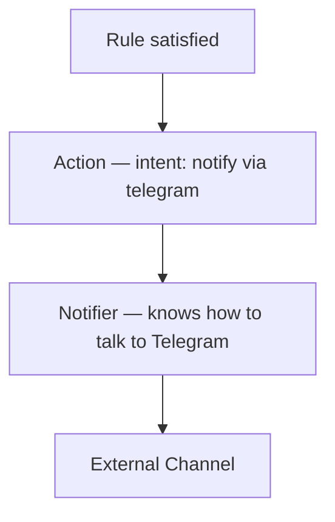
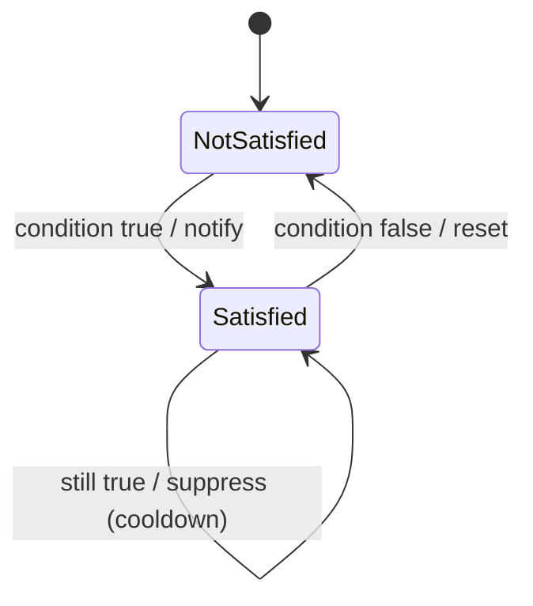

# RFC-0007 — Notification

**Status:** Draft
**Author:** carvalhosauro
**Version:** 1.0

---

# 1. Purpose

This RFC defines how **Actions** produced by the Rule Engine are turned into delivered **Notifications**.

It specifies the relationship between Action, Notifier, and external delivery channels.

In V1 the only channel is Telegram.

---

# 2. Motivation

The Rule Engine must not know how messages are delivered.

It only declares an intent: *something happened, notify*.

Separating the intent (Action) from the delivery (Notifier) keeps the domain free of integration details and allows new channels without touching Rules.

---

# 3. Philosophy

The notification layer must be:

* Decoupled from the Rule Engine
* Channel-agnostic at the Action level
* Idempotent where possible
* Fault-isolated
* Observable

A delivery failure must never crash the monitoring cycle.

---

# 4. Action vs Notifier



* An **Action** is a domain intent. It knows nothing about APIs.
* A **Notifier** executes an Action against a concrete channel.

Actions are defined in RFC-0001 and the domain model (RFC-0000 §5.11).

---

# 5. Responsibilities

A Notifier must:

* receive an Action and a Context;
* render a message;
* deliver it to the external channel;
* classify delivery errors;
* emit delivery events.

A Notifier must never:

* evaluate Rules;
* fetch market data;
* mutate the Context;
* decide *whether* a Rule fired.

---

# 6. Contract

Every Notifier implements the same behavior.

Conceptually:

```text
notify(action, context, channel_config)
```

Returns:

```text
{:ok, delivery}
```

or

```text
{:error, reason}
```

This contract is the Notifier Behaviour defined in RFC-0014.

---

# 7. Message Rendering

A message is rendered from the Context (RFC-0002).

Rendering must be deterministic: the same Context and Rule always produce the same message.

A default template includes:

* the Asset;
* the Rule name that fired;
* the relevant fields (price, change_percent, ...);
* the timestamp.

Example:

```text
🚨 petr4 — breakout
price: 40.12  (+3.4%)
2026-07-01 10:30
```

Custom templates are a future extension.

---

# 8. Telegram (V1)

In V1 the only Notifier is Telegram.

Its configuration is the `Telegram` resource from RFC-0003:

```yaml
apiVersion: v1
kind: Telegram
metadata:
  name: telegram
spec:
  token: ${TELEGRAM_TOKEN}
  chat_id: ${CHAT_ID}
```

Credentials come from environment variables and never from plain YAML.

All Telegram-specific logic stays isolated in this Notifier.

---

# 9. Deduplication and Cooldown

A Rule that stays satisfied across cycles must not spam notifications.

The notification layer applies:

* **deduplication**: identical consecutive alerts are suppressed;
* **cooldown**: a minimum interval between repeated alerts for the same Rule and Asset.

The state required for dedup and cooldown is owned by State Management (RFC-0012).

The decision itself is owned by a pure core module — `Vigil.Core.NotificationPolicy` — which the Runtime consults before dispatch (RFC-0015 §12). Notifiers never make this decision.

The cooldown interval is configured per Rule via `spec.cooldown`, with a global default in `Defaults` (RFC-0003 §5.2, §5.4); it is the Rule's execution policy (RFC-0001 §3).

V1 defaults: notify on transition into the satisfied state; suppress while it remains satisfied.



---

# 10. Delivery Failures

A failed delivery is classified, not silently dropped.

Minimum categories:

* Network Error
* Authentication Error
* Rate Limit
* Invalid Target
* Channel Unavailable

Failures are reported through Events (RFC-0009) and handled per RFC-0013.

---

# 11. Retry Policy

Retry of failed deliveries belongs to the Runtime, not the Notifier.

The Notifier only reports the error.

The Runtime decides whether and when to retry, consistent with RFC-0004 §11 and RFC-0013.

Dispatch is asynchronous: delivery never blocks or aborts the monitoring cycle, and delivery retry is bounded by the cooldown window (RFC-0015 §12).

---

# 12. Concurrency

Notifiers must be safe for concurrent execution.

Multiple Rules across multiple Assets may produce Actions simultaneously.

A slow delivery on one channel must never block another, and must never block the monitoring cycle.

---

# 13. Observability

Every delivery emits Events (RFC-0009).

Minimum events:

* notification.sent
* notification.failed
* notification.suppressed

These feed Observability (RFC-0011).

---

# 14. Extensibility

New Notifiers implement the same Behaviour (RFC-0014).

Future channels:

* Discord
* Slack
* Email
* Webhook

Adding a channel must not require changes to the Rule Engine or to Actions.

---

# 15. Out of Scope

This RFC does not define:

* Rule evaluation (RFC-0001);
* the configuration schema (RFC-0003);
* the event bus (RFC-0009);
* state storage for cooldown (RFC-0012);
* the Behaviour mechanism (RFC-0014).

---

# 16. Decisions

## DEC-001

An Action is a channel-agnostic intent; a Notifier executes it.

## DEC-002

The Rule Engine never knows how messages are delivered.

## DEC-003

Every Notifier returns `{:ok, delivery}` or `{:error, reason}`.

## DEC-004

Message rendering is deterministic.

## DEC-005

Deduplication and cooldown prevent repeated alerts; V1 notifies on transition into satisfied. The cooldown interval is configured via `spec.cooldown` (RFC-0003 §5.2/§5.4).

## DEC-006

Retry belongs to the Runtime, not the Notifier.

## DEC-007

A delivery failure never crashes the monitoring cycle.

## DEC-008

V1 supports exclusively Telegram.
