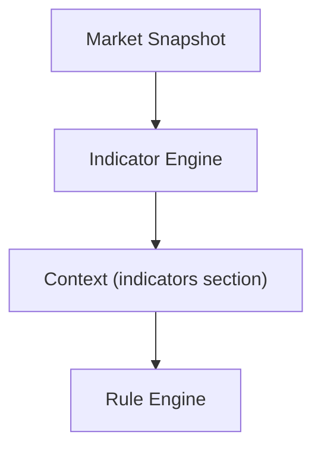
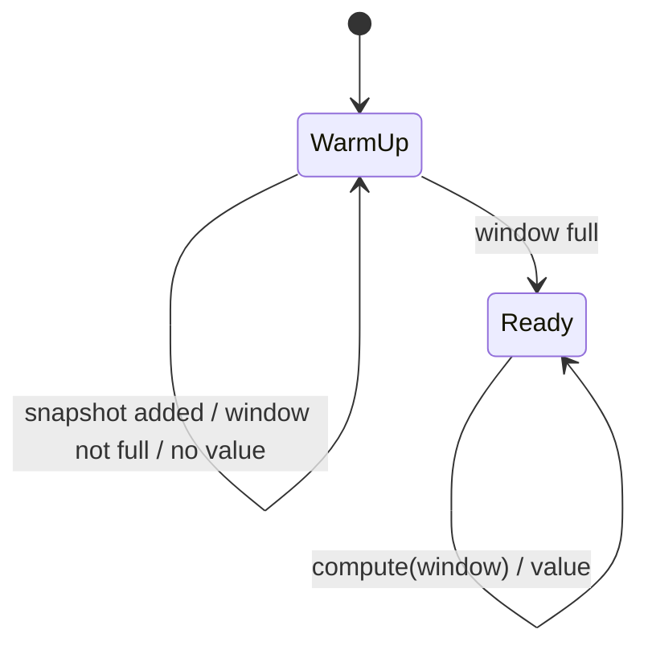

# RFC-0008 — Indicators

**Status:** Draft
**Author:** carvalhosauro
**Version:** 1.0

---

# 1. Purpose

This RFC defines the **Indicator** abstraction and the **Indicator Engine**.

An Indicator transforms market data into derived information that enriches the Context (RFC-0002).

It specifies the Indicator contract, how indicators are computed, and how they obtain the history they need.

---

# 2. Motivation

Raw market data answers *what is the price now*.

Indicators answer *how is the price behaving* — trends, averages, momentum, volatility.

Rules need this derived information to express meaningful conditions, without computing it themselves.

Indicators isolate this calculation in one place.

---

# 3. Philosophy

An Indicator must be:

* Pure with respect to its inputs
* Deterministic
* Independent of Providers
* Independent of Notifiers
* Independent of the Rule Engine

An Indicator only computes new values.

It never sends notifications and never queries Providers (RFC-0000 §5.7).

---

# 4. Position in the Flow



Indicators run after the Market Snapshot exists and before the Context is finalized.

They write only into the Context `indicators` section (RFC-0002 §9).

---

# 5. Responsibilities

An Indicator must:

* receive the current Market Snapshot and the history it needs;
* compute one or more derived values;
* return those values to the Indicator Engine.

An Indicator must never:

* fetch market data;
* mutate the Market Snapshot;
* evaluate Rules;
* trigger Actions;
* depend on a specific Provider.

---

# 6. Contract

Every Indicator implements the same behavior.

Conceptually:

```text
compute(window) -> value
```

Where `window` is the ordered series of recent snapshots required by the Indicator.

This contract is the Indicator Behaviour defined in RFC-0014.

---

# 7. Windows and History

Most Indicators are **stateful over time**: an SMA20 needs the last 20 data points.

The Indicator Engine maintains a rolling **window** per Asset and per Indicator.

```text
Asset: petr4
  sma20  ──► window of last 20 closes
  rsi14  ──► window of last 14 changes
```

The storage of these windows is owned by State Management (RFC-0012).

The Indicator itself stays pure: it receives the window and returns a value.

---

# 8. V1 Indicators

V1 may ship with an **empty** indicator set, as allowed by RFC-0002 §9.

The first indicators planned:

| Indicator | Description                 |
| --------- | --------------------------- |
| SMA       | Simple Moving Average       |
| EMA       | Exponential Moving Average  |
| VWAP      | Volume-Weighted Avg Price   |
| RSI       | Relative Strength Index     |
| ATR       | Average True Range          |

Each indicator is independent and added without touching the others.

---

# 9. Configuration

Indicators are declared, not hard-coded.

A future `Indicator` resource follows the CRD base structure (RFC-0003 §13):

```yaml
apiVersion: v1
kind: Indicator
metadata:
  name: sma20
spec:
  type: sma
  field: close
  period: 20
```

The Context exposes computed indicators by name, so Rules can reference them (RFC-0001 §14).

---

# 10. Warm-up

An Indicator with insufficient history is in **warm-up**.

During warm-up its value is undefined.

Rules referencing an undefined indicator must not fire on it; the indicator simply yields no value until its window is full.



---

# 11. Determinism

Given the same window, an Indicator always returns the same value.

There is no randomness, no wall-clock dependency, and no side effects.

This makes indicators trivially testable with fixed input series.

---

# 12. Concurrency

Indicators for different Assets compute independently and concurrently.

Window state is isolated per Asset (RFC-0012).

A failure computing one indicator must not corrupt another or abort the cycle; it yields no value and is reported.

---

# 13. Observability

The Indicator Engine emits Events (RFC-0009).

Minimum events:

* indicator.computed
* indicator.failed
* indicator.warmup

These feed Observability (RFC-0011).

---

# 14. Extensibility

New Indicators implement the same Behaviour (RFC-0014).

Adding an Indicator must not require changes to:

* the Rule Engine;
* the Provider;
* existing Indicators.

The Context is the only contract an Indicator touches.

---

# 15. Out of Scope

This RFC does not define:

* the Context structure (RFC-0002);
* Rule syntax for indicators (RFC-0001);
* window persistence (RFC-0012);
* the Behaviour mechanism (RFC-0014).

---

# 16. Decisions

## DEC-001

An Indicator only computes derived values.

## DEC-002

Indicators write exclusively into the Context `indicators` section.

## DEC-003

Indicators are pure and deterministic over their input window.

## DEC-004

Window state is owned by State Management, not by the Indicator.

## DEC-005

An Indicator in warm-up yields no value, and Rules cannot fire on it.

## DEC-006

V1 may ship with an empty indicator set.

## DEC-007

New Indicators are added without changing the Rule Engine or Provider.
