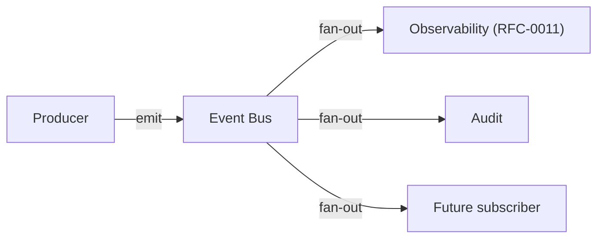
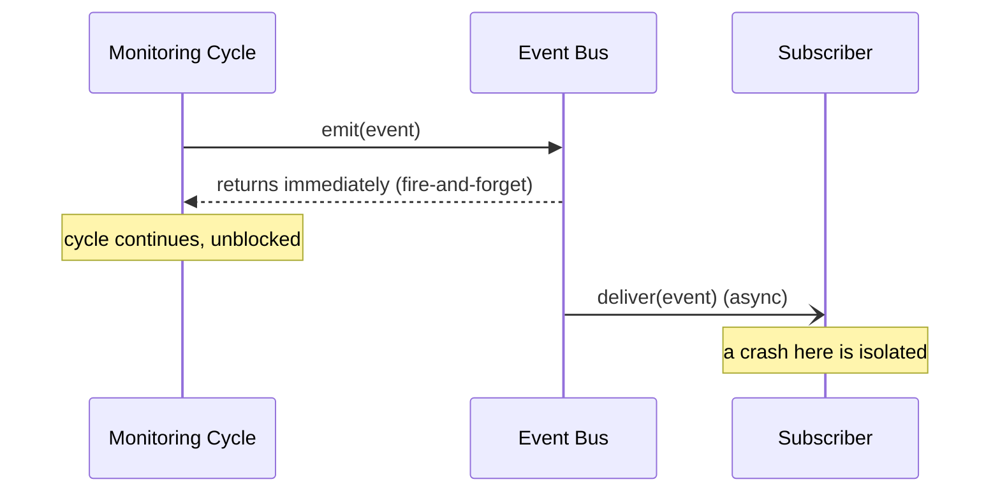

# RFC-0009 — Events

**Status:** Draft
**Author:** carvalhosauro
**Version:** 1.0

---

# 1. Purpose

This RFC defines the **Event** model: the occurrences produced during processing, and how they are published and consumed.

Events are the backbone of observability and auditing (RFC-0000 §5.13).

They decouple the components that *produce* facts from the components that *react* to them.

---

# 2. Motivation

Many components need to know that something happened:

* Observability needs metrics and logs;
* auditing needs a record of decisions;
* future features need triggers.

If every producer called every consumer directly, the system would be tightly coupled.

Events invert this: producers emit, consumers subscribe.

---

# 3. Philosophy

The event system must be:

* Decoupled
* Asynchronous
* Non-blocking
* Fire-and-forget for producers
* Side-effect-free with respect to the domain

Emitting an event must never change the result of a monitoring cycle.

If no one is listening, emission is a no-op.

---

# 4. What an Event Is

An Event is an immutable record of something that already happened.

It is past-tense and factual.

```text
RuleTriggered     — a Rule was satisfied
NotificationSent  — a notification was delivered
ProviderUnavailable — a Provider could not be reached
ReloadCompleted   — a configuration reload was applied
```

An Event never represents a command or a request.

---

# 5. Event Structure

Every Event shares a common envelope:

| Field     | Type     | Description                      |
| --------- | -------- | -------------------------------- |
| name      | string   | dotted event name                |
| timestamp | datetime | when it occurred                 |
| asset     | string   | related Asset, if any            |
| payload   | map      | event-specific data              |

Example:

```yaml
name: rule.triggered
timestamp: 2026-07-01T10:30:00Z
asset: petr4
payload:
  rule: breakout
  price: 40.12
```

---

# 6. Naming Convention

Event names are lowercase and dotted, scoped by component.

```text
<component>.<subject>.<result>
```

Examples:

```text
scheduler.cycle.triggered
provider.request.failed
indicator.computed
rule.triggered
notification.sent
reload.completed
```

This convention is shared with Observability (RFC-0011).

---

# 7. Catalog

A minimum catalog of V1 events, by component:

| Component | Events                                                        |
| --------- | ------------------------------------------------------------- |
| Scheduler | cycle.triggered, cycle.skipped                                |
| Provider  | request.started, request.finished, request.failed             |
| Indicator | computed, failed, warmup                                      |
| Rule      | triggered, evaluated                                          |
| Notifier  | sent, failed, suppressed                                     |
| Reload    | started, completed, rejected                                  |
| Runtime   | error, recovered                                              |

Each owning RFC defines the events it emits; this RFC defines the model.

---

# 8. Publish / Subscribe



* Producers emit without knowing subscribers.
* Subscribers register interest by event name or prefix.
* Delivery is asynchronous.

A subscriber crashing must never crash the producer.

---

# 9. Decoupling Guarantee

Producers never block on consumers.

Event handling happens outside the monitoring cycle's critical path.



A slow or failing subscriber affects only itself.

This isolation follows OTP supervision principles.

---

# 10. Ordering and Delivery

Within a single Asset, events are emitted in the order they occur.

Across Assets, no global ordering is guaranteed.

V1 delivery is **at-most-once** and in-memory; events are not persisted.

Durable, replayable event streams are a future extension.

---

# 11. Relationship to Observability

Observability (RFC-0011) is the primary subscriber.

It turns Events into:

* metrics;
* structured logs;
* health signals.

Events are the source; Observability is a consumer. The mapping to `:telemetry` is defined in RFC-0011.

---

# 12. Relationship to Errors

Error conditions are surfaced as Events (`*.failed`, `runtime.error`).

Events describe that an error happened.

Handling, retry, and supervision are defined in RFC-0013.

Emitting an error event is not the same as handling the error.

---

# 13. Extensibility

New event types are added freely.

Adding an event must not require existing subscribers to change.

Subscribers ignore events they do not handle.

Future extensions:

* persistent event log;
* replay;
* external sinks.

---

# 14. Out of Scope

This RFC does not define:

* metrics and logging (RFC-0011);
* error handling and supervision (RFC-0013);
* the CLI (RFC-0010);
* persistence of events (future).

---

# 15. Decisions

## DEC-001

An Event is an immutable, past-tense record of something that happened.

## DEC-002

Producers emit fire-and-forget; they never block on subscribers.

## DEC-003

Emitting an event never changes the result of a monitoring cycle.

## DEC-004

Event names follow `<component>.<subject>.<result>`.

## DEC-005

V1 delivery is in-memory and at-most-once; events are not persisted.

## DEC-006

Observability is a consumer of Events, not their owner.

## DEC-007

An error event reports an error; it does not handle it.
