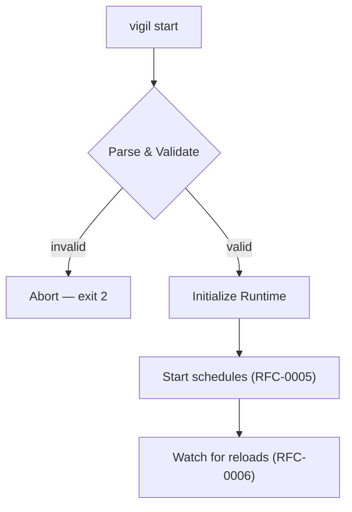
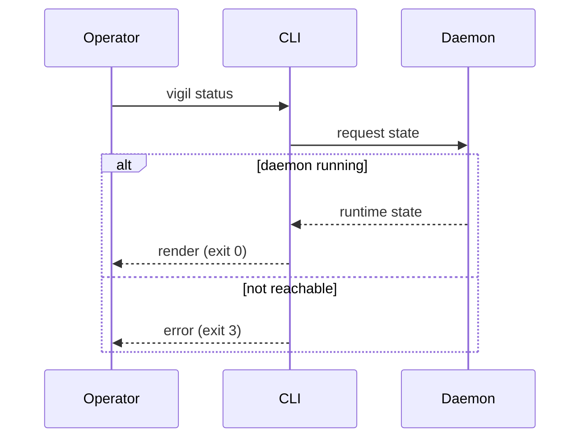

# RFC-0010 — CLI

**Status:** Draft
**Author:** carvalhosauro
**Version:** 1.0

---

# 1. Purpose

This RFC defines the **command-line interface** of Vigil.

The CLI is the operator's entry point: starting the daemon, validating configuration, inspecting state, and triggering reloads.

It is an interface to the running system, never a place where business logic lives.

---

# 2. Motivation

Operators need a predictable, scriptable way to:

* check that configuration is valid before running;
* start and stop the daemon;
* inspect what the daemon is doing;
* apply configuration changes on demand.

A clear CLI makes Vigil operable and CI-friendly.

---

# 3. Philosophy

The CLI must be:

* Declarative-friendly
* Scriptable
* Deterministic
* Quiet on success, explicit on failure
* Free of business logic

The CLI delegates to the same components the daemon uses; it never reimplements them.

---

# 4. Command Overview

```text
vigil validate     validate configuration
vigil start        start the daemon
vigil status       show runtime status
vigil reload       trigger a configuration reload
vigil version      print version
```

V1 ships exactly these commands.

---

# 5. Global Options

| Option        | Description                          |
| ------------- | ------------------------------------ |
| --config DIR  | configuration directory              |
| --log-level   | log verbosity                        |
| --format      | output format (text, json)           |

`--config` defaults to the conventional `configs/` directory (RFC-0003 §4).

---

# 6. validate

Validates the full configuration without starting the daemon.

It runs the same parse and validation path as reload (RFC-0006 §7–8).

```text
$ vigil validate
ok: 3 assets, 5 rules, 1 notifier
```

On error it lists every problem and exits non-zero:

```text
$ vigil validate
error: rules/breakout.yaml: unknown field "pricee"
error: assets/vale3.yaml: missing required field "symbol"
```

This makes `validate` suitable for CI.

---

# 7. start

Starts the daemon.

```text
$ vigil start --config ./configs
```

Startup sequence:

1. parse and validate configuration;
2. refuse to start if invalid;
3. initialize the Runtime;
4. start schedules (RFC-0005);
5. begin watching for reloads (RFC-0006).



An invalid configuration aborts startup with a non-zero exit code.

---

# 8. status

Reports the current runtime state.

```text
$ vigil status
asset   provider  interval  last_update  state
petr4   yahoo     30s       3s ago       online
vale3   yahoo     1m        12s ago      online
```

`status` reads runtime state (RFC-0012) and observability data (RFC-0011).

With `--format json` it emits machine-readable output.

---

# 9. reload

Triggers a manual configuration reload.

```text
$ vigil reload
reload: 1 added, 1 changed, 0 removed
```

A manual reload follows the exact same path as a filesystem reload (RFC-0006 §15).

A rejected reload exits non-zero and leaves the running configuration untouched.

---

# 10. version

Prints the Vigil version and exits.

```text
$ vigil version
vigil 1.0.0
```

---

# 11. Exit Codes

| Code | Meaning                  |
| ---- | ------------------------ |
| 0    | success                  |
| 1    | generic error            |
| 2    | invalid configuration    |
| 3    | daemon not reachable     |

Stable exit codes make the CLI scriptable.

---

# 12. Output Format

Default output is human-readable text.

`--format json` produces structured output for every command that reports data.

Errors always go to stderr; data goes to stdout.

---

# 13. Relationship to the Daemon

Commands that inspect or control a running daemon (`status`, `reload`) communicate with it.

If no daemon is running, those commands fail clearly with exit code 3.



`validate` and `version` run without a daemon.

---

# 14. Observability

CLI actions that affect the system emit Events (RFC-0009), so manual operations appear in the same audit trail as automatic ones.

---

# 15. Extensibility

Future commands must follow the same conventions:

* stable exit codes;
* text and json output;
* no business logic in the CLI.

Possible future commands:

* `vigil rules` — list loaded rules;
* `vigil test` — dry-run a rule against a Context;
* `vigil stop` — graceful shutdown.

---

# 16. Out of Scope

This RFC does not define:

* the configuration format (RFC-0003);
* reload mechanics (RFC-0006);
* the metrics exposed (RFC-0011);
* runtime state internals (RFC-0012).

---

# 17. Decisions

## DEC-001

The CLI contains no business logic; it delegates to Runtime components.

## DEC-002

`validate` runs the same path as reload and is CI-suitable.

## DEC-003

The daemon refuses to start with an invalid configuration.

## DEC-004

Manual reload shares the single reconciliation path of RFC-0006.

## DEC-005

Exit codes are stable and documented.

## DEC-006

Every command supports text and json output; errors go to stderr.
