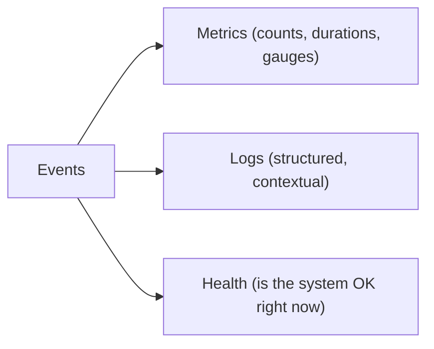
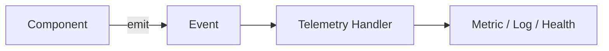

# RFC-0011 — Observability

**Status:** Draft
**Author:** carvalhosauro
**Version:** 1.0

---

# 1. Purpose

This RFC defines **Observability**: how Vigil exposes what it is doing through metrics, structured logs, and health signals.

Observability consumes Events (RFC-0009) and turns them into operator-facing signals.

It never changes the behavior of the system it observes.

---

# 2. Motivation

A long-running daemon must be inspectable:

* is it healthy;
* are Providers responding;
* how often are Rules firing;
* are notifications being delivered.

Without observability, failures are silent and the system is unoperable.

---

# 3. Philosophy

Observability must be:

* Passive (read-only with respect to the domain)
* Event-driven
* Low-overhead
* Structured
* Always-on

Observability is a **consumer** of Events.

It is never a producer of domain behavior.

---

# 4. The Three Signals



All three derive from the same Event stream (RFC-0009).

---

# 5. Telemetry Pipeline

Vigil emits telemetry through a standard, OTP-native mechanism (`:telemetry`).



Handlers are attached at startup and translate events using the naming convention from RFC-0009 §6.

Attaching or detaching a handler must never affect the emitting component.

---

# 6. Metrics

Metrics are derived from events.

Minimum V1 metrics:

| Metric                          | Type      | Source event              |
| ------------------------------- | --------- | ------------------------- |
| provider.requests.total         | counter   | provider.request.finished |
| provider.failures.total         | counter   | provider.request.failed   |
| provider.request.duration       | histogram | provider.request.*        |
| rules.triggered.total           | counter   | rule.triggered            |
| notifications.sent.total        | counter   | notification.sent         |
| notifications.failed.total      | counter   | notification.failed       |
| scheduler.cycles.total          | counter   | scheduler.cycle.triggered |

Metrics are dimensioned by Asset where relevant.

---

# 7. Logging

Logs are **structured**, not free-form strings.

Every log entry carries context:

```yaml
level: info
event: rule.triggered
asset: petr4
rule: breakout
timestamp: 2026-07-01T10:30:00Z
```

Log level is configurable (RFC-0010 §5).

Secrets are never logged (RFC-0003 §5.3).

---

# 8. Health

Health answers a single question: *is Vigil working right now?*

It is derived from runtime state (RFC-0012) and recent events.

| Signal             | Healthy when                         |
| ------------------ | ------------------------------------ |
| provider_online    | recent requests are succeeding       |
| scheduler_active   | cycles are firing on schedule        |
| consecutive_failures | below a configured threshold       |

Health is surfaced through `vigil status` (RFC-0010 §8).

---

# 9. Per-Asset Visibility

Observability is dimensioned per Asset.

An operator can answer, for any single Asset:

* when it was last updated;
* whether its Provider is responding;
* how often its Rules fire;
* its current runtime state.

---

# 10. Overhead

Observability must be low-overhead and must never sit on the critical path of a monitoring cycle.

Handler work happens asynchronously, consistent with the fire-and-forget guarantee of RFC-0009 §9.

A failing handler must not affect monitoring.

---

# 11. No Behavior Change

Observability is strictly read-only with respect to the domain.

Turning observability off must not change *what* the system does — only the operator's ability to see it.

This is the core invariant of this RFC.

---

# 12. Extensibility

The telemetry pipeline allows new sinks without changing producers:

* Prometheus / OpenTelemetry export;
* external log aggregation;
* dashboards;
* alerting on metrics.

New sinks attach as additional handlers.

---

# 13. Out of Scope

This RFC does not define:

* the Event model itself (RFC-0009);
* error handling and recovery (RFC-0013);
* runtime state storage (RFC-0012);
* the CLI (RFC-0010).

---

# 14. Decisions

## DEC-001

Observability consumes Events; it never produces domain behavior.

## DEC-002

Metrics, logs, and health all derive from the same Event stream.

## DEC-003

Telemetry uses an OTP-native, fire-and-forget mechanism.

## DEC-004

Logs are structured and never contain secrets.

## DEC-005

Observability never sits on the critical path of a monitoring cycle.

## DEC-006

Turning observability off must not change what the system does.

## DEC-007

New sinks attach as handlers without changing producers.
