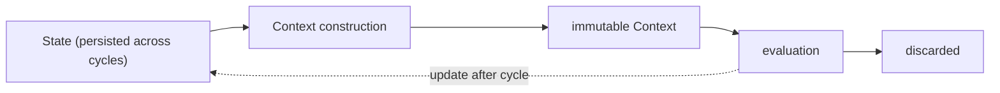
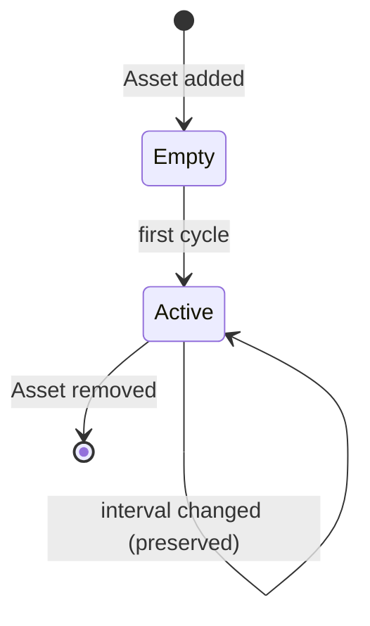
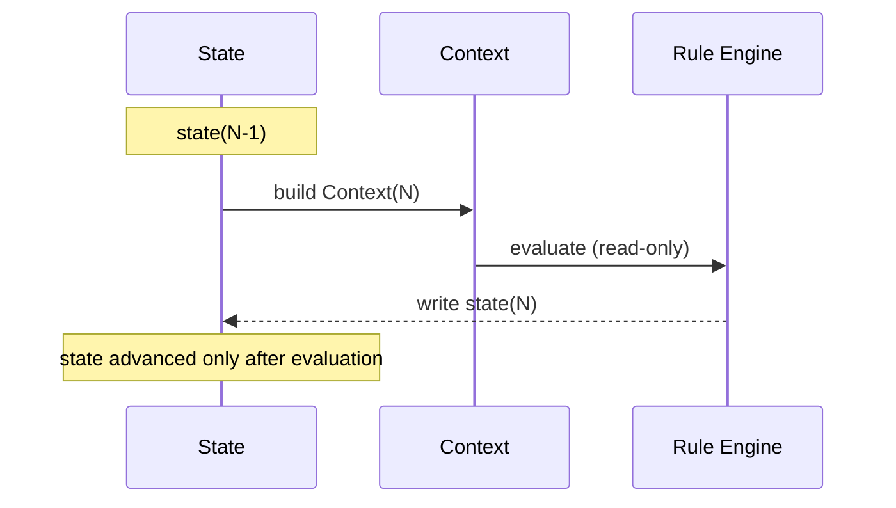

# RFC-0012 — State Management

**Status:** Draft
**Author:** carvalhosauro
**Version:** 1.0

---

# 1. Purpose

This RFC defines how Vigil manages **runtime state**: the information the daemon must remember between monitoring cycles.

The Context is immutable and discarded each cycle (RFC-0002).

State Management owns the data that must *survive* across cycles.

---

# 2. Motivation

Several features cannot work from a single snapshot:

* derived metrics like `change` need the previous price;
* indicators like SMA20 need a window of history (RFC-0008);
* notification cooldown needs the last alert time (RFC-0007);
* health needs `consecutive_failures`.

This memory must live somewhere well-defined, isolated per Asset.

---

# 3. Philosophy

State Management must be:

* Per-Asset isolated
* Explicit (no hidden global state)
* Concurrency-safe
* Bounded (memory does not grow without limit)
* Ephemeral in V1

State is an implementation concern, never exposed to Rules. Rules see only the Context.

---

# 4. What Is State

State is anything the daemon must remember beyond a single cycle.

| Category            | Examples                                |
| ------------------- | --------------------------------------- |
| Previous snapshot   | last price/close for derived metrics    |
| Indicator windows   | rolling series per indicator (RFC-0008) |
| Rule trigger state  | last fired, satisfied/not satisfied     |
| Notification state  | last alert time, cooldown (RFC-0007)    |
| Runtime health      | consecutive_failures, last_success      |

---

# 5. What Is Not State

The Context is **not** state.

It is rebuilt every cycle and discarded after evaluation (RFC-0002 §4).

State Management feeds *inputs* into Context construction; it is not the Context itself.



---

# 6. Per-Asset Isolation

Each Asset owns its own state.

```text
state[petr4] = { prev, windows, rules, notifications, health }
state[vale3] = { prev, windows, rules, notifications, health }
```

State for one Asset is never visible to another.

This isolation follows OTP principles: per-Asset state lives in an isolated, supervised unit.

---

# 7. Lifecycle

```text
Asset added    ──► initialize empty state
each cycle     ──► read state ─► build Context ─► evaluate ─► update state
Asset removed  ──► discard state
interval change──► state preserved (RFC-0006 §12)
```

State is created and destroyed in lockstep with Asset configuration.



---

# 8. Update Rules

State is updated **after** evaluation, never during.

This preserves Context immutability: the Context for cycle N is built from state as of cycle N−1, and only after evaluation is state advanced to N.

```text
read state(N-1) → Context(N) → evaluate → write state(N)
```



---

# 9. Bounded Memory

State must be bounded.

* Indicator windows keep only the period they need.
* Rule and notification state keep only the latest relevant values.
* No unbounded history is retained in V1.

Bounded state keeps the daemon's memory footprint predictable.

---

# 10. Concurrency

Different Assets update their state concurrently.

Within a single Asset, state transitions are serialized: a cycle reads and writes that Asset's state atomically.

There is no shared mutable state across Assets.

---

# 11. Persistence

V1 state is **in-memory and ephemeral**.

On restart, state is empty and rebuilt:

* derived metrics resume after the first new cycle;
* indicators re-enter warm-up (RFC-0008 §10);
* cooldown timers reset.

This is consistent with RFC-0004 §14 (no cache in V1).

Durable persistence is a future extension and must not change the state contract.

---

# 12. Restart Behavior

A restart is a clean slate.

```text
before restart: full windows, active cooldowns
after restart:  empty state, indicators warming up
```

This is acceptable for V1 and explicitly documented so operators understand the trade-off.

---

# 13. Relationship to Other Components

| Component       | Uses state for                          |
| --------------- | --------------------------------------- |
| Context (0002)  | previous values, runtime fields         |
| Indicators (0008) | rolling windows                       |
| Notification (0007) | dedup and cooldown                  |
| Observability (0011) | health signals                     |

State Management serves these components; it never evaluates Rules or sends notifications.

---

# 14. Extensibility

Future extensions must preserve the contract:

* durable persistence (disk, ETS dump, database);
* state replay after restart;
* configurable retention windows.

Any of these may be added without changing how components read and write state.

---

# 15. Out of Scope

This RFC does not define:

* the Context structure (RFC-0002);
* indicator math (RFC-0008);
* cooldown policy (RFC-0007);
* persistence format (future).

---

# 16. Decisions

## DEC-001

State is anything that must survive across cycles; the Context is not state.

## DEC-002

State is isolated per Asset.

## DEC-003

State is read before the cycle and updated only after evaluation.

## DEC-004

State is bounded; no unbounded history in V1.

## DEC-005

V1 state is in-memory and ephemeral; restart is a clean slate.

## DEC-006

Rules never see state directly — only the Context.

## DEC-007

Durable persistence is a future extension that must not change the state contract.
