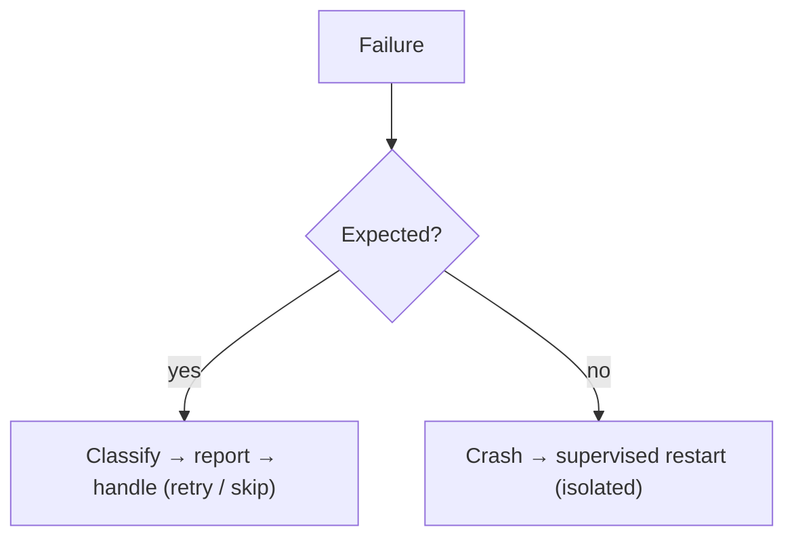
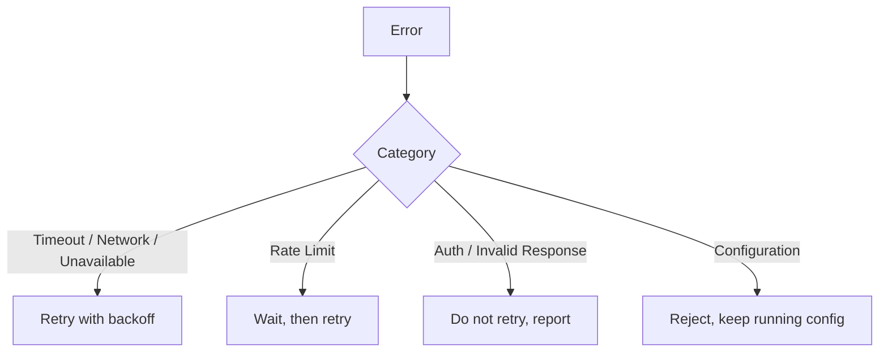
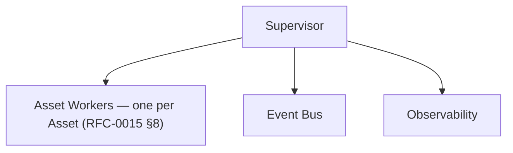

# RFC-0013 — Error Handling

**Status:** Draft
**Author:** carvalhosauro
**Version:** 1.0

---

# 1. Purpose

This RFC defines how Vigil handles **errors and failures**: classification, isolation, retry, and recovery.

It is the home of error classification and supervision principles.

The Runtime (RFC-0015) applies them when orchestrating the monitoring cycle: the retry policy other RFCs delegate to "the Runtime" (RFC-0004 §11, RFC-0005 §12, RFC-0007 §11) uses the categories defined here with the concrete values fixed in RFC-0015 §10.

---

# 2. Motivation

A monitoring daemon runs continuously against unreliable external systems.

APIs time out, networks drop, credentials expire.

The system must keep running and keep monitoring the rest of the Assets even when one part fails.

Errors must be expected, classified, and contained — never fatal by surprise.

---

# 3. Philosophy

Error handling follows OTP principles:

* Isolate failures
* Let unexpected faults crash and be restarted by a supervisor
* Keep the rest of the system running
* Make failures observable

A failure in one Asset must never take down another.

A failure in delivery must never abort monitoring.

---

# 4. Two Kinds of Failure



* **Expected failures** are domain outcomes: timeouts, rate limits, invalid responses. They return `{:error, reason}`.
* **Unexpected faults** are bugs or impossible states. They crash and are restarted, isolated to the failing unit.

---

# 5. Error Classification

All expected errors are classified into stable categories.

| Category               | Origin              |
| ---------------------- | ------------------- |
| Timeout                | Provider, Notifier  |
| Network Error          | Provider, Notifier  |
| Authentication Error   | Provider, Notifier  |
| Invalid Response       | Provider            |
| Rate Limit             | Provider, Notifier  |
| Unavailable            | Provider, Notifier  |
| Configuration Error    | Reload              |

This extends the Provider categories of RFC-0004 §10 across the whole system.

As atoms in the standardized Error struct (RFC-0004 §10): `:timeout`, `:network`, `:authentication`, `:invalid_response`, `:rate_limit`, `:unavailable`, `:configuration`.

An error that fits no category is not classified: it is an unexpected fault, and its unit crashes and is restarted (§4, RFC-0015 DEC-006).

---

# 6. Fault Isolation

Each Asset is monitored in isolation.

```text
petr4 cycle fails  ──► petr4 affected only
vale3 cycle        ──► unaffected, keeps running
```

Isolation boundaries:

* per-Asset scheduling (RFC-0005);
* per-Asset state (RFC-0012);
* independent delivery (RFC-0007).

A crash in one boundary is contained by its supervisor.

---

# 7. Retry Policy

Retry is owned by the Runtime, centralizing what the Provider and Notifier delegate; the concrete attempts, backoff, and budget are fixed in RFC-0015 §10.

V1 policy:

* retry transient errors (Timeout, Network Error, Unavailable);
* do **not** retry permanent errors (Authentication, Invalid Response, Configuration);
* use bounded retries with exponential backoff;
* respect Rate Limit signals before retrying.



---

# 8. Backoff

Retries use exponential backoff with a ceiling.

```text
attempt 1: wait 1s
attempt 2: wait 2s
attempt 3: wait 4s
...        capped at a maximum
```

Backoff prevents hammering a failing external system.

V1 concrete values (attempts, base, ceiling, budget) are fixed in RFC-0015 §10.

The Scheduler continues to fire ticks independently (RFC-0005 §12); backoff governs retries within a cycle, not the cadence.

---

# 9. Supervision

Vigil is structured as a supervision tree.



Each Asset Worker owns its Asset's schedule, state, and cycle execution (RFC-0015 §8).

A crashing child is restarted by its supervisor without affecting siblings.

Restart strategy is chosen so that one Asset's failure restarts only that Asset.

---

# 10. Degraded Operation

The system must keep running while degraded.

| Condition               | Behavior                                   |
| ----------------------- | ------------------------------------------ |
| Provider down for asset | mark `provider_online: false`, keep ticking|
| Notifier down           | suppress/queue delivery, keep monitoring   |
| One Asset crashing       | restart it, keep others running           |

`provider_online` and `consecutive_failures` are exposed in the Context (RFC-0002) and health (RFC-0011). `provider_online` flips to false at 5 consecutive failures — the threshold fixed in RFC-0015 §11.

---

# 11. Error Events

Every handled error emits an Event (RFC-0009).

```text
provider.request.failed
notification.failed
reload.rejected
runtime.error
runtime.recovered
```

Emitting an error event reports the error; the handling described here is separate (RFC-0009 §12).

---

# 12. Configuration Errors

Configuration errors are a distinct class.

They never crash the daemon.

A broken configuration is rejected at validation time and the previous valid configuration keeps running (RFC-0006 §13).

---

# 13. Failure Visibility

Every failure is observable:

* classified with a stable category;
* emitted as an Event;
* counted as a metric (RFC-0011);
* reflected in health.

Silent failure is forbidden.

---

# 14. Extensibility

Future extensions must preserve isolation and classification:

* configurable retry policies per Provider;
* circuit breakers;
* dead-letter handling for notifications;
* alerting on repeated failures.

Each builds on the categories defined here without changing them.

---

# 15. Out of Scope

This RFC does not define:

* Provider internals (RFC-0004);
* the Event model (RFC-0009);
* metrics and health rendering (RFC-0011);
* state storage (RFC-0012).

---

# 16. Decisions

## DEC-001

Expected failures are classified and returned; unexpected faults crash and are supervised.

## DEC-002

A failure in one Asset never affects another.

## DEC-003

A delivery failure never aborts monitoring.

## DEC-004

Retry and backoff are owned by the Runtime.

## DEC-005

Transient errors are retried with bounded exponential backoff; permanent errors are not.

## DEC-006

Configuration errors never crash the daemon.

## DEC-007

Every failure is observable; silent failure is forbidden.
