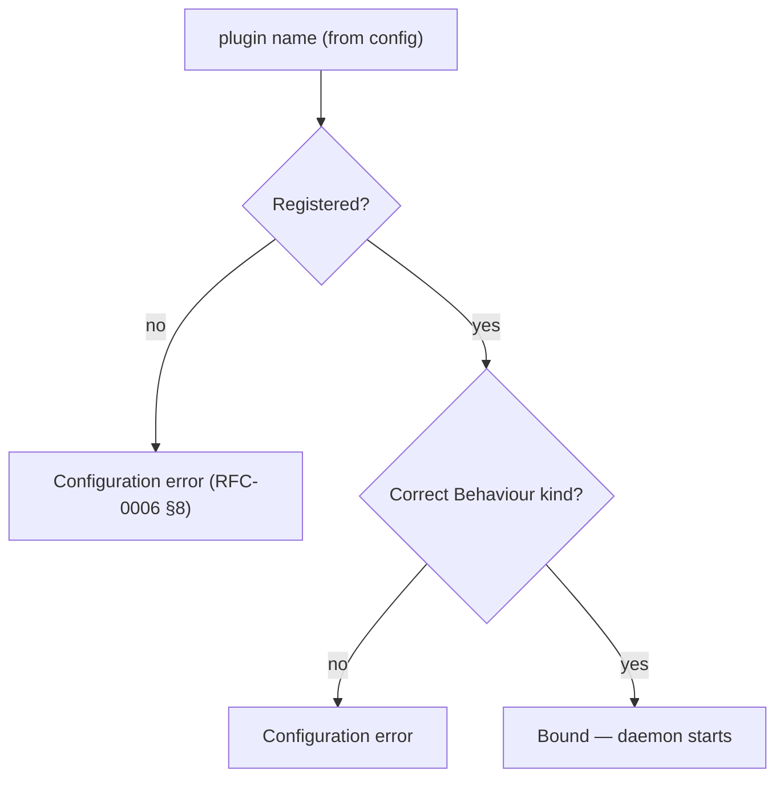

# RFC-0014 — Behaviours & Plugin System

**Status:** Draft
**Author:** carvalhosauro
**Version:** 1.0

---

# 1. Purpose

This RFC defines the **extension contracts** of Vigil: the Behaviours that Providers, Indicators, and Notifiers implement, and how new implementations are registered.

It is the foundation for the extensibility promised throughout the domain model (RFC-0000 §8).

---

# 2. Motivation

Vigil must evolve by **adding** components, never by modifying the core.

A new market source, a new indicator, or a new notification channel must plug in without touching the Scheduler, the Context, or the Rule Engine.

This is only possible if each extension point is a stable, explicit contract.

---

# 3. Philosophy

The plugin system must be:

* Contract-first
* Core-stable (extensions never modify the core)
* Uniform (each kind has one contract)
* Discoverable (configuration references implementations by name)
* Isolated (a plugin failure is contained, RFC-0013)

A Behaviour is a contract.

A plugin is an implementation of that contract.

---

# 4. What a Behaviour Is

A Behaviour is an explicit interface a module must implement, following the Elixir/OTP notion of behaviours.

```text
Behaviour = the set of functions an implementation must provide
Plugin    = a module that implements a Behaviour
```

The core depends only on Behaviours, never on concrete implementations.

---

# 5. The Three Core Behaviours

```mermaid
classDiagram
    class Provider {
        <<behaviour>>
        fetch(asset) {:ok, MarketSnapshot} | {:error, reason}
    }
    class Indicator {
        <<behaviour>>
        compute(window) value
    }
    class Notifier {
        <<behaviour>>
        notify(action, context) {:ok, delivery} | {:error, reason}
    }
    Core ..> Provider : depends on
    Core ..> Indicator : depends on
    Core ..> Notifier : depends on
```

The Core depends only on the Behaviours, never on concrete implementations.

Each is defined in its own RFC; this document unifies them as the extension model.

---

# 6. Provider Behaviour

A Provider implements:

```text
fetch(asset) -> {:ok, MarketSnapshot} | {:error, reason}
```

Defined in RFC-0004 §6.

A Provider is stateless and returns the standard Market Snapshot contract.

---

# 7. Indicator Behaviour

An Indicator implements:

```text
compute(window) -> value
```

Defined in RFC-0008 §6.

An Indicator is pure and deterministic over its input window.

---

# 8. Notifier Behaviour

A Notifier implements:

```text
notify(action, context) -> {:ok, delivery} | {:error, reason}
```

Defined in RFC-0007 §6.

A Notifier renders and delivers, and never decides whether a Rule fired.

---

# 9. Contract Stability

A Behaviour is a public contract.

| Change                     | Allowed |
| -------------------------- | ------- |
| add a new optional callback | yes    |
| add a new Behaviour         | yes    |
| remove a callback           | no     |
| change a callback's meaning | no     |
| change return shape         | no      |

Incompatible changes require a new contract version, mirroring RFC-0003 §12.

---

# 10. Registration

Configuration **references** plugins declaratively, by name; the daemon resolves each name to a registered implementation.

In V1 the registry is a **static, compile-time map** from name to module, with an environment-variable escape hatch for overrides. Dynamic, config-driven registration is a future extension (§14). What is declarative in V1 is the *reference* (config selects by name), not the *registration*.

A configuration resource selects an implementation by name:

```yaml
spec:
  provider: yahoo     # resolves to the Provider plugin "yahoo"
```

```yaml
spec:
  type: sma           # resolves to the Indicator plugin "sma"
```

```yaml
actions:
  - telegram          # resolves to the Notifier plugin "telegram"
```

Names are the binding between configuration (RFC-0003) and implementations.

---

# 11. Resolution

At load time, every referenced plugin name must resolve to a registered implementation of the correct Behaviour.



An unresolved or wrong-kind plugin name is a `:configuration` error (RFC-0013 §5) and never starts the daemon (RFC-0010 §7).

---

# 12. Isolation

A plugin runs within the isolation guarantees of RFC-0013.

* A crashing plugin is contained by its supervisor.
* A misbehaving plugin affects only its Asset or delivery.
* The core keeps running.

Plugins are never trusted to be infallible.

---

# 13. Built-in Plugins (V1)

V1 ships exactly:

| Kind      | Plugin   |
| --------- | -------- |
| Provider  | yahoo    |
| Notifier  | telegram |
| Indicator | (none)   |

These built-ins implement the same Behaviours any future plugin would.

There is no privileged path for built-ins.

In V1 the built-ins are wired into the static registry map described in §10.

---

# 14. Extensibility

New plugins are added without modifying the core:

* Providers: Alpha Vantage, Finnhub, Polygon, Brapi, Binance;
* Indicators: SMA, EMA, VWAP, RSI, ATR;
* Notifiers: Discord, Slack, Email, Webhook.

Each implements its Behaviour and registers a name. Nothing in the core changes.

---

# 15. Out of Scope

This RFC does not define:

* the per-Behaviour semantics (RFC-0004, 0007, 0008);
* configuration schema (RFC-0003);
* reload and resolution timing (RFC-0006);
* error handling internals (RFC-0013).

---

# 16. Decisions

## DEC-001

The core depends only on Behaviours, never on concrete implementations.

## DEC-002

Vigil is extended by adding plugins, never by modifying the core.

## DEC-003

There are three core Behaviours: Provider, Indicator, Notifier.

## DEC-004

A Behaviour is a public contract; incompatible changes require a new version.

## DEC-005

Plugins are referenced by name; in V1 the registry is a static compile-time map (with an env-var override). Dynamic registration is a future extension.

## DEC-006

An unresolved or wrong-kind plugin is a configuration error and never starts the daemon.

## DEC-007

Built-in plugins use the same Behaviours as any third-party plugin; there is no privileged path.
