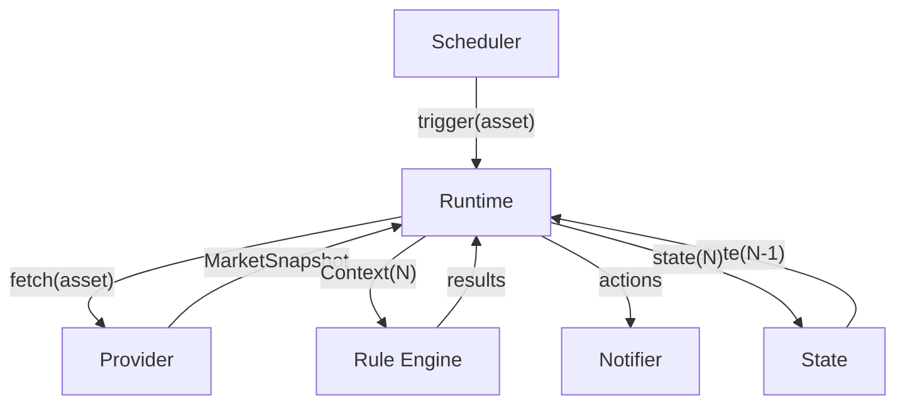
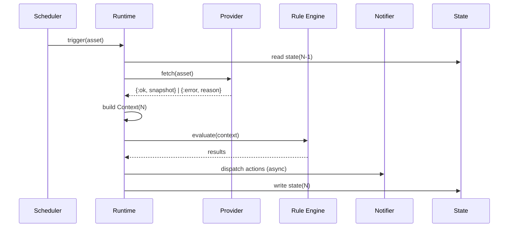
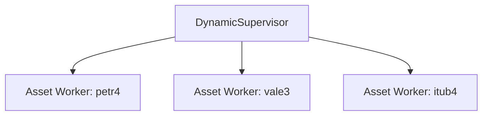

# RFC-0015 — Runtime

**Status:** Draft
**Author:** carvalhosauro
**Version:** 1.0

---

# 1. Purpose

This RFC defines the **Runtime**, the component that executes the monitoring cycle.

The Runtime is the glue every other RFC delegates to: it receives the Scheduler's trigger, calls the Provider, builds the Context, runs the Rule Engine, dispatches Actions, and advances State.

It owns retry, backoff, and cycle-level failure handling.

---

# 2. Motivation

Every RFC points at the Runtime, and none defines it:

* RFC-0004 §11: retry policy belongs to the Runtime;
* RFC-0005 §5: the Runtime wires the trigger to the Provider;
* RFC-0007 §11: retry of failed deliveries belongs to the Runtime;
* RFC-0013 §7: retry is owned by the Runtime.

Without an owner document, the cycle's sequencing, overlap behavior, and retry budget are implementation folklore.

This RFC makes them explicit.

---

# 3. Philosophy

The Runtime must be:

* Per-Asset isolated
* Sequential within an Asset
* Concurrent across Assets
* Bounded in time (a cycle never outlives its usefulness)
* Fault-isolated
* Observable

The Runtime orchestrates.

It never implements domain logic: no fetching, no rule semantics, no message rendering.

---

# 4. Responsibilities

The Runtime must:

* execute exactly one cycle per trigger, or skip it explicitly;
* resolve the Provider by name through the registry (RFC-0014 §10);
* apply the retry policy of RFC-0013 §7 within the cycle;
* build the Context in the order defined by RFC-0002 §11;
* run the Rule Engine and dispatch resulting Actions;
* advance per-Asset State only after evaluation (RFC-0012 §8);
* maintain runtime health fields (`provider_online`, `consecutive_failures`, `last_success`);
* emit the lifecycle and error Events other RFCs promise (RFC-0004 §15, RFC-0009, RFC-0013 §11).

The Runtime must never:

* fetch or parse market data itself (RFC-0004);
* evaluate rule conditions itself (RFC-0001);
* render or deliver notifications itself (RFC-0007);
* decide *when* a cycle starts (RFC-0005);
* mutate a Context after construction (RFC-0002 §12).

---

# 5. Data Flow



The Runtime is the only component that talks to all of them.

None of them talk to each other.

---

# 6. Contract

Conceptually:

```text
run_cycle(asset) -> {:ok, cycle_report} | {:skipped, reason} | {:error, reason}
```

A `cycle_report` summarizes what happened: snapshot obtained, rules evaluated, actions dispatched, state advanced.

The trigger carries only the Asset identity (RFC-0005 DEC-003); everything else is resolved inside the cycle.

---

# 7. The Cycle

Every cycle follows the same sequence.

```text
1. read   state(N-1)                        (RFC-0012 §8)
2. fetch  Provider → MarketSnapshot         (RFC-0004, with retry §9 below)
3. build  Derived Metrics                   (RFC-0002 §8)
4. build  Indicators                        (RFC-0008; empty in V1)
5. build  Runtime State fields              (RFC-0002 §10)
6. freeze Context(N)                        (immutable, RFC-0002 §12)
7. eval   Rule Engine over Context(N)       (RFC-0001)
8. send   Actions → Notifier                (RFC-0007, fire-and-forget §12 below)
9. write  state(N)                          (RFC-0012 §8)
```



Steps never reorder.

A cycle that cannot complete step 2 still executes steps 5, 9 for the health fields, and emits its failure (§10).

---

# 8. Process Model

Each Asset is owned by one supervised, long-lived **Asset Worker**.

The worker owns three things for its Asset:

* the schedule (RFC-0005);
* the state (RFC-0012);
* cycle execution (this RFC).

Conceptually Scheduler, State, and Runtime remain separate components; physically they share the worker so that per-Asset serialization (RFC-0012 §10) is free.



Workers are independent.

One worker crashing or lagging never affects another (RFC-0013 DEC-002).

---

# 9. Overlap and Skipping

Within one Asset, cycles are strictly sequential.

If a tick fires while the previous cycle is still running, the tick is **skipped**, never queued.

```text
tick 1 ──► cycle 1 (slow: retries in progress)
tick 2 ──► skipped, emits scheduler.cycle.skipped
tick 3 ──► cycle 2 (fresh)
```

Rationale: a stale cycle would evaluate stale data; the next tick fetches fresher data anyway.

Queueing would build unbounded lag behind a slow Provider.

---

# 10. Retry and Backoff

Retry happens **inside the cycle**, between the Runtime and the Provider, following RFC-0013 §7 categories.

V1 concrete policy:

| Parameter                        | Value                          |
| -------------------------------- | ------------------------------ |
| max attempts per cycle           | 3 (1 initial + 2 retries)      |
| backoff                          | 1s, 2s (exponential, base 1s)  |
| backoff ceiling                  | 30s                            |
| retry budget                     | never past the next tick       |
| retried categories               | timeout, network, unavailable  |
| waited category                  | rate_limit (honor provider hint when present) |
| never retried                    | authentication, invalid_response, configuration |

If the budget would cross the Asset's next tick, remaining retries are abandoned and the cycle fails; the next tick starts clean.

An error the Provider cannot classify is not an expected failure — it is a fault, and the worker crashes and is restarted by its supervisor (RFC-0013 §4).

Providers must never launder unknown errors into a transient category.

---

# 11. Health Fields

The Runtime is the writer of the runtime section of the Context (RFC-0002 §10).

| Field                  | Rule                                                        |
| ---------------------- | ----------------------------------------------------------- |
| consecutive_failures   | +1 per failed cycle (after retries), reset to 0 on success  |
| provider_online        | `consecutive_failures < 5`                                  |
| last_success           | timestamp of the last successful cycle                      |
| market_open            | taken from the Provider snapshot when available (§14 Open Questions) |

A failed cycle still advances health state: read state, increment failures, write state, emit events.

Silent failure is forbidden (RFC-0013 DEC-007).

---

# 12. Action Dispatch

Rule results that require notification are handed to the Notifier **asynchronously**.

The cycle does not wait for delivery.

* Delivery failure emits `notification.failed` and never aborts monitoring (RFC-0013 DEC-003).
* Delivery retry is owned by the Runtime on the Notifier's behalf, with the same backoff table (§10), bounded to the cooldown window (RFC-0007 §9).
* Dedup and cooldown decisions happen before dispatch, using notification state (RFC-0012 §4).

---

# 13. Reconciliation

On configuration change (RFC-0006):

| Change           | Runtime action                                     |
| ---------------- | -------------------------------------------------- |
| Asset added      | start a worker with empty state                    |
| Asset removed    | terminate the worker; discard in-flight cycle      |
| interval changed | reschedule; preserve state (RFC-0006 §12)          |
| Asset unchanged  | no action                                          |

An in-flight cycle of a removed Asset is abandoned; its results are never delivered.

---

# 14. Open Questions

To resolve before this RFC leaves Draft:

* **market_open source** — Provider snapshot field, or a market-calendar computation (timezone, B3 holidays)? V1 recommendation: take it from the Provider when the API exposes it, default `true` otherwise, and document the imprecision. A calendar is a future extension.
* **Rate-limit wait vs. skip** — when the provider signals rate limit with a hint longer than the next tick, should the worker suspend upcoming ticks (backpressure) or keep ticking and failing? V1 recommendation: keep ticking; each tick fails fast while the window lasts.
* **Cycle timeout ceiling** — is the next-tick budget (§10) enough, or does a cycle also need an absolute ceiling for very long intervals (e.g. `1h` assets)? V1 recommendation: absolute ceiling of 60s per cycle.

---

# 15. Observability

Emits Events (RFC-0009):

* runtime.cycle.started
* runtime.cycle.finished
* runtime.cycle.failed
* runtime.error
* runtime.recovered

The Runtime also emits the Provider request events on the Provider's behalf, wrapping each fetch:

* provider.request.started
* provider.request.finished
* provider.request.failed

This satisfies RFC-0004 §15 while keeping Providers pure fetch-and-normalize functions.

---

# 16. Extensibility

Future extensions must not change the cycle contract:

* circuit breakers per Provider (RFC-0013 §14);
* configurable retry tables per Provider;
* backpressure-aware scheduling on sustained rate limits;
* cycle tracing with per-step timings.

Each changes *how* a step behaves, never the sequence.

---

# 17. Out of Scope

This RFC does not define:

* when ticks fire (RFC-0005);
* how data is fetched and normalized (RFC-0004);
* rule semantics (RFC-0001);
* message rendering and delivery transport (RFC-0007);
* state storage shape (RFC-0012);
* the Event model (RFC-0009);
* supervision tree layout beyond the Asset Worker (RFC-0013 §9).

---

# 18. Decisions

## DEC-001

The Runtime executes exactly one cycle per trigger, or skips it explicitly; ticks are never queued.

## DEC-002

Each Asset is owned by one supervised Asset Worker that serializes schedule, state, and cycle execution.

## DEC-003

The cycle sequence (read state → fetch → build Context → evaluate → dispatch → write state) never reorders.

## DEC-004

Retry lives inside the cycle: max 3 attempts, exponential backoff from 1s capped at 30s, never past the next tick.

## DEC-005

Only timeout, network, and unavailable errors are retried; rate limit waits; everything else fails the cycle immediately.

## DEC-006

Unclassifiable errors are faults: the worker crashes and is restarted, never silently classified as transient.

## DEC-007

A failed cycle still advances health state and emits events; it never evaluates rules on stale data.

## DEC-008

Action dispatch is asynchronous; delivery never blocks or aborts the monitoring cycle.

## DEC-009

The Runtime emits provider.request.* events on the Provider's behalf; Providers stay pure.
