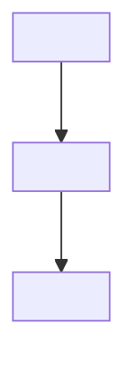
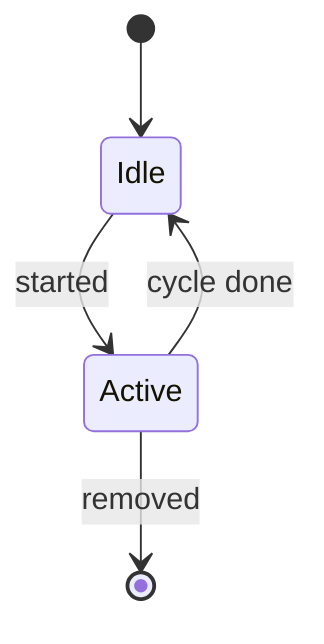

<!--
RFC TEMPLATE — copy this file to RFC-XXXX-<Title>.md and fill it in.

Conventions (match RFC-0000..RFC-0014):
- Filename: RFC-XXXX-Kebab-Case-Title.md  (XXXX = next free number, zero-padded)
- One idea per line, short declarative sentences, generous whitespace.
- Stay conceptual + light OTP flavor: {:ok, ...} / {:error, reason}, Behaviours,
  Runtime, supervision, :telemetry. Do NOT name concrete modules/libs.
- Diagrams use ```text``` or ```mermaid```. Field lists use markdown tables.
- Sections are numbered with `# N. Title`. Keep them sequential.
- Cross-reference other RFCs by id, e.g. "(RFC-0002 §9)".
- ALWAYS end with "Out of Scope" then "Decisions" (DEC-NNN).
- Delete sections that do not apply; keep the order of the ones you keep.
- Remove every <!-- comment --> before finalizing.
-->

# RFC-XXXX — <Title>

**Status:** Draft
**Author:** carvalhosauro
**Version:** 1.0

---

# 1. Purpose

<!-- One paragraph: what this RFC defines and why it exists. -->
<!-- State the single responsibility of this component. -->

This RFC defines **<component>**.

---

# 2. Motivation

<!-- Why is this needed? What breaks or couples without it? -->

---

# 3. Philosophy

<!-- The non-negotiable properties. Bullet list of adjectives/constraints. -->

<component> must be:

* Decoupled
* Deterministic
* Independent of <other components>
* Fault-isolated
* Observable

---

# 4. Responsibilities

<!-- What it MUST do and what it MUST NEVER do. The "never" list prevents scope creep. -->

<component> must:

* ...

<component> must never:

* ...

---

# 5. Data Flow

<!-- Where it sits in the pipeline. Keep arrows consistent with RFC-0000 §6. -->
<!-- Prefer a mermaid diagram. Use flowchart for pipelines, stateDiagram for -->
<!-- lifecycles, sequenceDiagram for interactions, classDiagram for contracts. -->



---

# 6. Contract

<!-- The conceptual interface. Use OTP-style tuples. This is the Behaviour (RFC-0014) if it is an extension point. -->

Conceptually:

```text
<operation>(input) -> {:ok, result} | {:error, reason}
```

---

# 7. <Domain Section A>

<!-- Repeat sections 7..N for the specifics of THIS component. -->
<!-- Examples used across existing RFCs: Structure, Lifecycle, Configuration, -->
<!-- Validation, Concurrency, Immutability, Normalization, Retry Policy, etc. -->

---

# 8. Concurrency

<!-- Concurrency/isolation guarantees. Most components are per-Asset isolated. -->

---

# 9. Failure Handling

<!-- How errors surface. Defer retry/supervision to the Runtime (RFC-0013). -->
<!-- A stateDiagram of the component's lifecycle, or a flowchart of the error -->
<!-- decision, fits well here. Example: -->



Errors are classified and reported (RFC-0013).

Retry and supervision belong to the Runtime.

---

# 10. Observability

<!-- Events emitted (RFC-0009). These feed Observability (RFC-0011) and never alter behavior. -->

Emits Events (RFC-0009):

* <component>.<subject>.<result>

---

# 11. Extensibility

<!-- How this grows without modifying the core. List future examples. -->

Future extensions:

* ...

---

# 12. Out of Scope

<!-- Always present. Point each excluded topic to its owning RFC. -->

This RFC does not define:

* ... (RFC-XXXX);
* ...

---

# 13. Decisions

<!-- Always present. One DEC per hard choice. These are the stable commitments. -->

## DEC-001

<decision statement>

## DEC-002

<decision statement>
